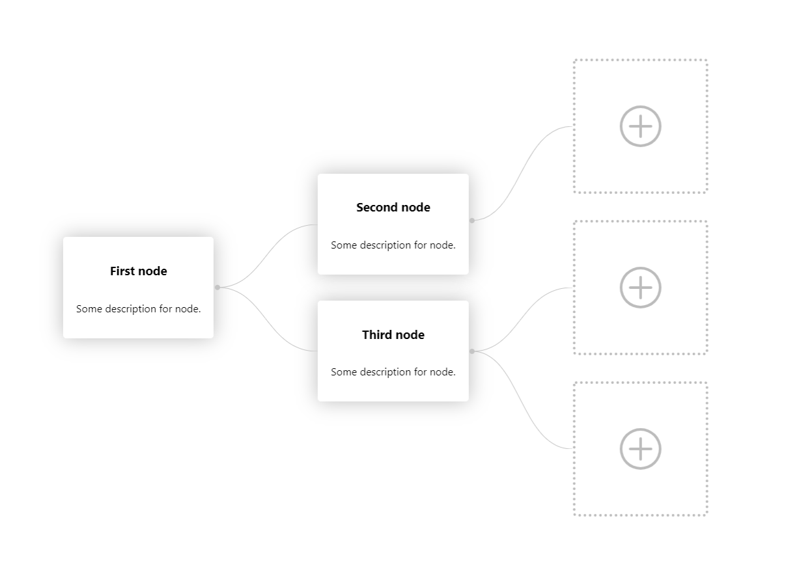

# treeview-component

> TreeView for tree data structure representation

[](https://www.npmjs.com/package/treeview-component) [](https://standardjs.com)



## Install

```bash
npm install --save treeview-component
```

## Properties
|Name|Description|
|---|---|
|nodeView|component which will represent as non-empty vertex|
|nodeViewClasses|imported styles for vertex|
|showEmptyNodes|boolean flag for showing empty vertexes|
|emptyNode|component which represent empty vertex|
|emptyNodeProps|properties for empty vertexes component|
|tree|object of tree structure for visualization|

## Usage

[Live demo](https://treeview-component.vercel.app/)

```jsx
import React, { useState } from 'react'

import { TreeView, TreeViewProps, TreeNode } from 'treeview-component'
import NodeView from './components/NodeView'
import EmptyNode from './components/EmptyNode'
import 'treeview-component/lib/esm/src/styles.module.css'
import styles from './classes.module.css'

const App: React.FC<any> = () => {
  const [tree, setTree] = useState<TreeNode>({
    node: '00',
    parent_node: null,
    title: 'First node',
    description: 'Some description for node.',
    children: [
      {
        node: '10',
        parent_node: '00',
        title: 'Second node',
        description: 'Some description for node.',
        children: [null]
      },
      {
        node: '11',
        parent_node: '00',
        title: 'Third node',
        description: 'Some description for node.',
        children: [null, null]
      }
    ]

  });

  const addCardFunc = (node: TreeNode, newTree: TreeNode) => {
    let tree = { ...newTree };
    const walker = (cell: TreeNode | null) => {
      if (!cell) {
        return
      }
      cell.children.forEach((child: TreeNode | null, id: number) => {
        if (child?.node === node.node) {
          cell.children[id] = {
            node: child.node,
            parent_node: cell.node,
            title: 'Added node',
            description: 'This node was added by click',
            children: [null, null],
          }
        }
        walker(child)
      })
    }
    walker(tree)
    setTree(tree)
  }

  const addCard = (event: React.MouseEvent<HTMLElement, MouseEvent>, data: { node: TreeNode, newTree: TreeNode }) => {
    addCardFunc(data.node, data.newTree);
  }

  const treeProps: TreeViewProps = {
    autoCenter: true,
    nodeView: NodeView,
    nodeViewClasses: styles,
    showEmptyNodes: true,
    emptyNode: EmptyNode,
    emptyNodeProps: {
      onClick: addCard,
      className: styles.add_card
    },
    tree,
    style: {
      cursor: 'auto',
      outline: 'none'
    }
  }

  return (
    <div className="wrapper">
      <TreeView {...treeProps} />
    </div>
  )

}

export default App
```

## License

MIT © [pavloid21](https://github.com/pavloid21)
